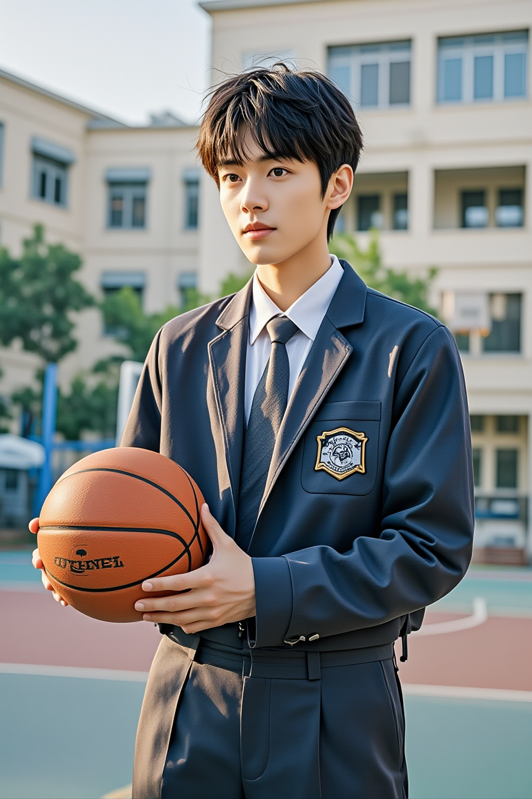
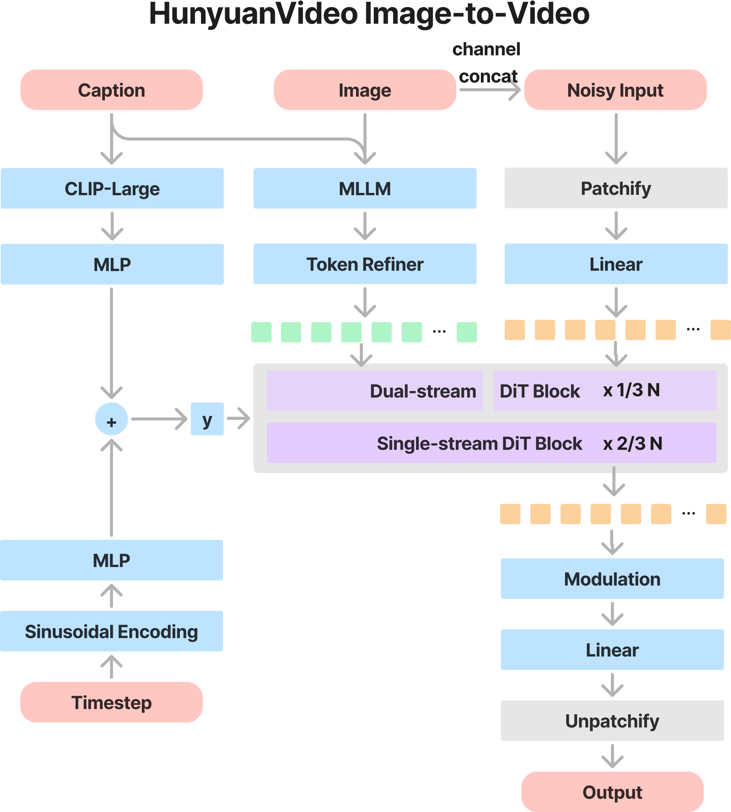

<!-- ## **HunyuanVideo** -->

[中文阅读](./README_zh.md)

<p align="center">
  
</p>

# **HunyuanVideo-I2V** 🌅

<div align="center">
  <a href="https://github.com/Tencent/HunyuanVideo-I2V"></a> &ensp;
  <a href="https://aivideo.hunyuan.tencent.com"></a> &ensp;
  <a href="https://video.hunyuan.tencent.com"></a>
</div>
<div align="center">
  <a href="https://arxiv.org/abs/2412.03603"></a> &ensp;
  <a href="https://aivideo.hunyuan.tencent.com/hunyuanvideo.pdf"></a>
</div>
<div align="center">
  <a href="https://huggingface.co/tencent/HunyuanVideo-I2V"></a> &ensp;
  <!-- <a href="https://huggingface.co/docs/diffusers/main/api/pipelines/hunyuan_video"></a> &ensp; -->
  <!-- <a href="https://huggingface.co/tencent/HunyuanVideo-PromptRewrite"></a> -->

<!-- 
 [](https://replicate.com/zsxkib/hunyuan-video) -->
</div>

<p align="center">
    👋 Join our <a href="assets/WECHAT.md" target="_blank">WeChat</a> and <a href="https://discord.gg/tv7FkG4Nwf" target="_blank">Discord</a> 
</p>
<p align="center">

-----

Following the great successful open-sourcing of our [HunyuanVideo](https://github.com/Tencent/HunyuanVideo), we proudly present the [HunyuanVideo-I2V](https://github.com/Tencent/HunyuanVideo-I2V), a new image-to-video generation framework to accelerate open-source community exploration!

This repo contains offical PyTorch model definitions, pre-trained weights and inference/sampling code. You can find more visualizations on our [project page](https://aivideo.hunyuan.tencent.com). Meanwhile, we have released the LoRA training code for customizable special effects, which can be used to create more interesting video effects.

> [**HunyuanVideo: A Systematic Framework For Large Video Generation Model**](https://arxiv.org/abs/2412.03603) <be>


## 🔥🔥🔥 News!!
* Mar 06, 2025: 👋 We release the inference code and model weights of HunyuanVideo-I2V. [Download](https://github.com/Tencent/HunyuanVideo-I2V/blob/main/ckpts/README.md).


## 🎥 Demo
### I2V Demo
<div align="center">
  <video src="https://github.com/user-attachments/assets/442afb73-3092-454f-bc46-02361c285930" width="80%" poster="./assets/video_poster.jpg"> </video>
  <p>Co-creator @D-aiY Director Ding Yi</p>
</div>

### Customizable I2V LoRA Demo

| I2V Lora Effect |  Reference Image | Generated Video  |
|:---------------:|:--------------------------------:|:----------------:|
|   Hair growth   |                 |       <video src="https://github.com/user-attachments/assets/06b998ae-bbde-4c1f-96cb-a25a9197d5cb" width="100%"> </video>        |
|     Embrace     |                |       <video src="https://github.com/user-attachments/assets/f8c99eb1-2a43-489a-ba02-6bd50a6dd260" width="100%" > </video>        |
<!-- |   Hair growth   |                 |       <video src="https://github.com/user-attachments/assets/06b998ae-bbde-4c1f-96cb-a25a9197d5cb" width="100%" poster="./assets/demo/i2v_lora/imgs/hair_growth.png"> </video>        |
|     Embrace     |                |       <video src="https://github.com/user-attachments/assets/f8c99eb1-2a43-489a-ba02-6bd50a6dd260" width="100%" poster="./assets/demo/i2v_lora/imgs/hair_growth.png"> </video>        | -->

<!-- ## 🧩 Community Contributions -->

<!-- If you develop/use HunyuanVideo-I2V in your projects, welcome to let us know. -->

<!-- - ComfyUI-Kijai (FP8 Inference, V2V and IP2V Generation): [ComfyUI-HunyuanVideoWrapper](https://github.com/kijai/ComfyUI-HunyuanVideoWrapper) by [Kijai](https://github.com/kijai) -->
<!-- - ComfyUI-Native (Native Support): [ComfyUI-HunyuanVideo](https://comfyanonymous.github.io/ComfyUI_examples/hunyuan_video/) by [ComfyUI Official](https://github.com/comfyanonymous/ComfyUI) -->

<!-- - FastVideo (Consistency Distilled Model and Sliding Tile Attention): [FastVideo](https://github.com/hao-ai-lab/FastVideo) and [Sliding Tile Attention](https://hao-ai-lab.github.io/blogs/sta/) by [Hao AI Lab](https://hao-ai-lab.github.io/)
- HunyuanVideo-gguf (GGUF Version and Quantization): [HunyuanVideo-gguf](https://huggingface.co/city96/HunyuanVideo-gguf) by [city96](https://huggingface.co/city96)
- Enhance-A-Video (Better Generated Video for Free): [Enhance-A-Video](https://github.com/NUS-HPC-AI-Lab/Enhance-A-Video) by [NUS-HPC-AI-Lab](https://ai.comp.nus.edu.sg/)
- TeaCache (Cache-based Accelerate): [TeaCache](https://github.com/LiewFeng/TeaCache) by [Feng Liu](https://github.com/LiewFeng)
- HunyuanVideoGP (GPU Poor version): [HunyuanVideoGP](https://github.com/deepbeepmeep/HunyuanVideoGP) by [DeepBeepMeep](https://github.com/deepbeepmeep)
 -->


## 📑 Open-source Plan
- HunyuanVideo-I2V (Image-to-Video Model)
  - [x] Lora training scripts
  - [x] Inference 
  - [x] Checkpoints
  - [x] ComfyUI
  - [ ] Multi-gpus Sequence Parallel inference (Faster inference speed on more gpus)
  - [ ] Diffusers 
  - [ ] FP8 Quantified weight

## Contents
- [**HunyuanVideo-I2V** 🌅](#hunyuanvideo-i2v-)
  - [🔥🔥🔥 News!!](#-news)
  - [🎥 Demo](#-demo)
    - [I2V Demo](#i2v-demo)
    - [Customizable I2V LoRA Demo](#customizable-i2v-lora-demo)
  - [📑 Open-source Plan](#-open-source-plan)
  - [Contents](#contents)
  - [**HunyuanVideo-I2V Overall Architecture**](#hunyuanvideo-i2v-overall-architecture)
  - [📜 Requirements](#-requirements)
  - [🛠️ Dependencies and Installation](#️-dependencies-and-installation)
    - [Installation Guide for Linux](#installation-guide-for-linux)
  - [🧱 Download Pretrained Models](#-download-pretrained-models)
  - [🔑 Single-gpu Inference](#-single-gpu-inference)
    - [Tips for Using Image-to-Video Models](#tips-for-using-image-to-video-models)
    - [Using Command Line](#using-command-line)
    - [More Configurations](#more-configurations)
  - [🎉 Customizable I2V LoRA effects training](#-customizable-i2v-lora-effects-training)
    - [Requirements](#requirements)
    - [Environment](#environment)
    - [Training data construction](#training-data-construction)
    - [Training](#training)
    - [Inference](#inference)
  - [🔗 BibTeX](#-bibtex)
  - [Acknowledgements](#acknowledgements)
---

## **HunyuanVideo-I2V Overall Architecture**
Leveraging the advanced video generation capabilities of [HunyuanVideo](https://github.com/Tencent/HunyuanVideo), we have extended its application to image-to-video generation tasks. To achieve this, we employ an image latent concatenation technique to effectively reconstruct and incorporate reference image information into the video generation process.

Since we utilizes a pre-trained Multimodal Large Language Model (MLLM) with a Decoder-Only architecture as the text encoder, we can significantly enhance the model's ability to comprehend the semantic content of the input image and to seamlessly integrate information from both the image and its associated caption. Specifically, the input image is processed by the MLLM to generate semantic image tokens. These tokens are then concatenated with the video latent tokens, enabling comprehensive full-attention computation across the combined data.

The overall architecture of our system is designed to maximize the synergy between image and text modalities, ensuring a robust and coherent generation of video content from static images. This integration not only improves the fidelity of the generated videos but also enhances the model's ability to interpret and utilize complex multimodal inputs. The overall architecture is as follows.
<p align="center">
  
</p>


## 📜 Requirements

The following table shows the requirements for running HunyuanVideo-I2V model (batch size = 1) to generate videos:

|      Model       | Resolution  | GPU Peak Memory  |
|:----------------:|:-----------:|:----------------:|
| HunyuanVideo-I2V |    720p     |       60GB        |


* An NVIDIA GPU with CUDA support is required. 
  * The model is tested on a single 80G GPU.
  * **Minimum**: The minimum GPU memory required is 60GB for 720p.
  * **Recommended**: We recommend using a GPU with 80GB of memory for better generation quality.
* Tested operating system: Linux

## 🛠️ Dependencies and Installation

Begin by cloning the repository:
```shell
git clone https://github.com/tencent/HunyuanVideo-I2V
cd HunyuanVideo-I2V
```

### Installation Guide for Linux

We recommend CUDA versions 12.4 or 11.8 for the manual installation.

Conda's installation instructions are available [here](https://docs.anaconda.com/free/miniconda/index.html).

```shell
# 1. Create conda environment
conda create -n HunyuanVideo-I2V python==3.11.9

# 2. Activate the environment
conda activate HunyuanVideo-I2V

# 3. Install PyTorch and other dependencies using conda
# For CUDA 12.4
conda install pytorch==2.4.0 torchvision==0.19.0 torchaudio==2.4.0 pytorch-cuda=12.4 -c pytorch -c nvidia

# 4. Install pip dependencies
python -m pip install -r requirements.txt

# 5. Install flash attention v2 for acceleration (requires CUDA 11.8 or above)
python -m pip install ninja
python -m pip install git+https://github.com/Dao-AILab/flash-attention.git@v2.6.3
```

In case of running into float point exception(core dump) on the specific GPU type, you may try the following solutions:

```shell
# Making sure you have installed CUDA 12.4, CUBLAS>=12.4.5.8, and CUDNN>=9.00 (or simply using our CUDA 12 docker image).
pip install nvidia-cublas-cu12==12.4.5.8
export LD_LIBRARY_PATH=/opt/conda/lib/python3.8/site-packages/nvidia/cublas/lib/
```

Additionally, HunyuanVideo-I2V also provides a pre-built Docker image. Use the following command to pull and run the docker image.

```shell
# For CUDA 12.4 (updated to avoid float point exception)
docker pull hunyuanvideo/hunyuanvideo-i2v:cuda_12
docker run -itd --gpus all --init --net=host --uts=host --ipc=host --name hunyuanvideo-i2v --security-opt=seccomp=unconfined --ulimit=stack=67108864 --ulimit=memlock=-1 --privileged hunyuanvideo/hunyuanvideo-i2v:cuda_12
```


## 🧱 Download Pretrained Models

The details of download pretrained models are shown [here](ckpts/README.md).


## 🔑 Single-gpu Inference

Similar to [HunyuanVideo](https://github.com/Tencent/HunyuanVideo), HunyuanVideo-I2V supports high-resolution video generation, with resolution up to 720P and video length up to 129 frames (5 seconds).

### Tips for Using Image-to-Video Models
- **Use Concise Prompts**: To effectively guide the model's generation, keep your prompts short and to the point.
- **Include Key Elements**: A well-structured prompt should cover:
  - **Main Subject**: Specify the primary focus of the video.
  - **Action**: Describe the main movement or activity taking place.
  - **Background (Optional)**: Set the scene for the video.
  - **Camera Angle (Optional)**: Indicate the perspective or viewpoint.
- **Avoid Overly Detailed Prompts**: Lengthy or highly detailed prompts can lead to unnecessary transitions in the video output.

<!-- **For image-to-video models, we recommend using concise prompts to guide the model's generation process. A good prompt should include elements such as background, main subject, action, and camera angle. Overly long or excessively detailed prompts may introduce unnecessary transitions.** -->

### Using Command Line

<!-- ### Run a Gradio Server
```bash
python3 gradio_server.py --flow-reverse

# set SERVER_NAME and SERVER_PORT manually
# SERVER_NAME=0.0.0.0 SERVER_PORT=8081 python3 gradio_server.py --flow-reverse
``` -->
```bash
cd HunyuanVideo-I2V

python3 sample_image2video.py \
    --model HYVideo-T/2 \
    --prompt "A man with short gray hair plays a red electric guitar." \
    --i2v-mode \
    --i2v-image-path ./assets/demo/i2v/imgs/0.png \
    --i2v-resolution 720p \
    --video-length 129 \
    --infer-steps 50 \
    --flow-reverse \
    --flow-shift 17.0 \
    --seed 0 \
    --use-cpu-offload \
    --save-path ./results 
```
### More Configurations

We list some more useful configurations for easy usage:

|        Argument        |            Default            |                          Description                          |
|:----------------------:|:-----------------------------:|:------------------------------------------------------------:|
|       `--prompt`       |             None              |           The text prompt for video generation.               |
|       `--model`        |      HYVideo-T/2-cfgdistill   | Here we use HYVideo-T/2 for I2V, HYVideo-T/2-cfgdistill is used for T2V mode. |
|     `--i2v-mode`       |            False              |                Whether to open i2v mode.                      |
|  `--i2v-image-path`    | ./assets/demo/i2v/imgs/0.png  |        The reference image for video generation.              |
|  `--i2v-resolution`    |            720p               |        The resolution for the generated video.                |
|    `--video-length`    |             129               |         The length of the generated video.                    |
|    `--infer-steps`     |              50               |         The number of steps for sampling.                     |
|     `--flow-shift`     |             7.0               |     Shift factor for flow matching schedulers .               |
|   `--flow-reverse`     |            False              | If reverse, learning/sampling from t=1 -> t=0.                |
|        `--seed`        |             None              | The random seed for generating video, if None, we init a random seed. |
|  `--use-cpu-offload`   |            False              | Use CPU offload for the model load to save more memory, necessary for high-res video generation. |
|     `--save-path`      |         ./results             |         Path to save the generated video.                     |


## 🎉 Customizable I2V LoRA effects training

### Requirements

The following table shows the requirements for training HunyuanVideo-I2V lora model (batch size = 1) to generate videos:

|      Model       | Resolution | GPU Peak Memory |
|:----------------:|:----------:|:---------------:|
| HunyuanVideo-I2V |    360p    |      79GB       |

* An NVIDIA GPU with CUDA support is required. 
  * The model is tested on a single 80G GPU.
  * **Minimum**: The minimum GPU memory required is 79GB for 360p.
  * **Recommended**: We recommend using a GPU with 80GB of memory for better generation quality.
* Tested operating system: Linux
* Note: You can train with 360p data and directly infer 720p videos

### Environment
```
pip install -r requirements.txt
```

### Training data construction
Prompt description: The trigger word is written directly in the video caption. It is recommended to use a phrase or short sentence.

For example, AI hair growth effect (trigger): rapid_hair_growth, The hair of the characters in the video is growing rapidly. + original prompt

After having the training video and prompt pair, refer to [here](hyvideo/hyvae_extract/README.md) for training data construction.


### Training
```
sh scripts/run_train_image2video_lora.sh
```
We list some training specific configurations for easy usage:

|     Argument     |                            Default                            |                         Description                         |
|:----------------:|:-------------------------------------------------------------:|:-----------------------------------------------------------:|
|   `SAVE_BASE`    |                               .                               |         Root path for saving experimental results.          |
|    `EXP_NAME`    |                           i2v_lora                            |        Path suffix for saving experimental results.         |
| `DATA_JSONS_DIR` | ./assets/demo/i2v_lora/train_dataset/processed_data/json_path | Data jsons dir generated by hyvideo/hyvae_extract/start.sh. |
|    `CHIEF_IP`    |                           127.0.0.1                           |            Master node IP of the machine.                   |

After training, you can find `pytorch_lora_kohaya_weights.safetensors` in `{SAVE_BASE}/log_EXP/*_{EXP_NAME}/checkpoints/global_step{*}/pytorch_lora_kohaya_weights.safetensors` and set it in `--lora-path` to perform inference.

### Inference
```bash
python3 sample_image2video.py \
    --model HYVideo-T/2 \
    --prompt "Two people hugged tightly, In the video, two people are standing apart from each other. They then move closer to each other and begin to hug tightly. The hug is very affectionate, with the two people holding each other tightly and looking into each other's eyes. The interaction is very emotional and heartwarming, with the two people expressing their love and affection for each other." \
    --i2v-mode \
    --i2v-image-path ./assets/demo/i2v_lora/imgs/embrace.png \
    --i2v-resolution 720p \
    --infer-steps 50 \
    --video-length 129 \
    --flow-reverse \
    --flow-shift 5.0 \
    --seed 0 \
    --use-cpu-offload \
    --save-path ./results \
    --use-lora \
    --lora-scale 1.0 \
    --lora-path ./ckpts/hunyuan-video-i2v-720p/lora/embrace_kohaya_weights.safetensors
```
We list some lora specific configurations for easy usage:

|      Argument       | Default |         Description          |
|:-------------------:|:-------:|:----------------------------:|
|    `--use-lora`     |  False  |  Whether to open lora mode.  |
|   `--lora-scale`    |   1.0   | Fusion scale for lora model. |
|   `--lora-path`     |   ""    |  Weight path for lora model. |


## 🔗 BibTeX

If you find [HunyuanVideo](https://arxiv.org/abs/2412.03603) useful for your research and applications, please cite using this BibTeX:

```BibTeX
@misc{kong2024hunyuanvideo,
      title={HunyuanVideo: A Systematic Framework For Large Video Generative Models}, 
      author={Weijie Kong, Qi Tian, Zijian Zhang, Rox Min, Zuozhuo Dai, Jin Zhou, Jiangfeng Xiong, Xin Li, Bo Wu, Jianwei Zhang, Kathrina Wu, Qin Lin, Aladdin Wang, Andong Wang, Changlin Li, Duojun Huang, Fang Yang, Hao Tan, Hongmei Wang, Jacob Song, Jiawang Bai, Jianbing Wu, Jinbao Xue, Joey Wang, Junkun Yuan, Kai Wang, Mengyang Liu, Pengyu Li, Shuai Li, Weiyan Wang, Wenqing Yu, Xinchi Deng, Yang Li, Yanxin Long, Yi Chen, Yutao Cui, Yuanbo Peng, Zhentao Yu, Zhiyu He, Zhiyong Xu, Zixiang Zhou, Zunnan Xu, Yangyu Tao, Qinglin Lu, Songtao Liu, Dax Zhou, Hongfa Wang, Yong Yang, Di Wang, Yuhong Liu, and Jie Jiang, along with Caesar Zhong},
      year={2024},
      archivePrefix={arXiv preprint arXiv:2412.03603},
      primaryClass={cs.CV},
      url={https://arxiv.org/abs/2412.03603}, 
}
```


## Acknowledgements

We would like to thank the contributors to the [SD3](https://huggingface.co/stabilityai/stable-diffusion-3-medium), [FLUX](https://github.com/black-forest-labs/flux), [Llama](https://github.com/meta-llama/llama), [LLaVA](https://github.com/haotian-liu/LLaVA), [Xtuner](https://github.com/InternLM/xtuner), [diffusers](https://github.com/huggingface/diffusers) and [HuggingFace](https://huggingface.co) repositories, for their open research and exploration.
Additionally, we also thank the Tencent Hunyuan Multimodal team for their help with the text encoder. 


<!-- ## Github Star History
<a href="https://star-history.com/#Tencent/HunyuanVideo&Date">
 <picture>
   <source media="(prefers-color-scheme: dark)" srcset="https://api.star-history.com/svg?repos=Tencent/HunyuanVideo&type=Date&theme=dark" />
   <source media="(prefers-color-scheme: light)" srcset="https://api.star-history.com/svg?repos=Tencent/HunyuanVideo&type=Date" />
   
 </picture>
</a> -->
